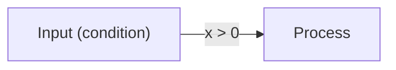

# Carta Input Specification

This document defines the formal input contract accepted by Carta. Keep this file aligned with `src/schema/posterSchema.ts`, `src/lib/prompt.ts`, renderer behavior, and examples whenever the poster input model changes.

## 1. Scope

Carta accepts a single poster object written as YAML or JSON. The object is parsed by `js-yaml`, validated by the Zod schema in `src/schema/posterSchema.ts`, and then rendered as a structured learning poster.

This specification covers only the poster input data model. UI controls such as preview width, font size, print columns, and export format are not part of the poster input object.

## 2. Data Format

The input MUST be one YAML or JSON object.

The top-level object MUST NOT be wrapped in Markdown fences, natural language, arrays, or additional envelope keys when it is supplied to the app editor or API.

YAML input MAY use block scalars for multiline strings. JSON input MUST escape strings according to JSON rules.

## 3. Top-Level Object

```yaml
title: "Poster title"
description: "Short poster description"
blocks: []
```

| Field | Type | Required | Constraints | Meaning |
| --- | --- | --- | --- | --- |
| `title` | string | yes | non-empty | Poster title. |
| `description` | string | yes | non-empty | One or two sentence summary of the poster. |
| `blocks` | `Block[]` | yes | at least 1 item | Ordered poster content blocks. |

## 4. Type Definitions

```ts
type Poster = {
  title: string
  description: string
  blocks: Block[]
}

type Block =
  | CardBlock
  | ColumnsBlock
  | DiagramBlock
  | FlowBlock
  | ListBlock

type CardContent =
  | MarkdownContent
  | DiagramContent
  | FlowBlock
  | ListBlock
  | LayoutContent
```

`Block` is used at the poster top level and inside `columns.columns`. `CardContent` is used only inside array-form `card.body` and inside `layout.columns`.

## 5. Common Enumerations

```ts
type PosterColor =
  | "danger"
  | "important"
  | "default"
  | "supplement"
  | "procedure"
  | "concept"
  | "term"
  | "context"
  | "note"

type FlowVariant = "steps" | "timeline"
type FlowDirection = "horizontal" | "vertical"
type ListVariant = "bullets" | "checklist" | "definitions"
type LayoutVariant = "side_by_side" | "aside"
type DiagramFormat = "mermaid" | "vega_lite"
```

Unknown enum values MUST be rejected.

## 6. Blocks

### 6.1 `card`

```ts
type CardBlock = {
  type: "card"
  title: string
  emoji?: string
  icon?: string
  color?: PosterColor
  body: string | CardContent[]
}
```

| Field | Type | Required | Constraints | Meaning |
| --- | --- | --- | --- | --- |
| `type` | `"card"` | yes | exact literal | Selects the card block. |
| `title` | string | yes | non-empty | Card heading. |
| `emoji` | string | no | none | Optional emoji marker. |
| `icon` | string | no | Lucide icon name at render time | Optional Lucide icon. If valid, it is preferred over `emoji`. |
| `color` | `PosterColor` | no | enum value | Semantic card role. |
| `body` | string or `CardContent[]` | yes | string must be non-empty; array must contain at least 1 item | Card content. |

String-form `body` is rendered as Markdown. Array-form `body` may contain `markdown`, `diagram`, `flow`, `list`, and `layout` content.

### 6.2 `columns`

```ts
type ColumnsBlock = {
  type: "columns"
  size?: number[]
  columns: Block[]
}
```

| Field | Type | Required | Constraints | Meaning |
| --- | --- | --- | --- | --- |
| `type` | `"columns"` | yes | exact literal | Selects a top-level block layout. |
| `size` | number[] | no | every number must be positive | Relative column width ratios. |
| `columns` | `Block[]` | yes | at least 1 item | Blocks displayed as columns. |

`columns.columns` contains `Block` items, not `CardContent` items. Do not put `layout` directly inside `columns.columns`, because `layout` is only valid as card content.

### 6.3 `diagram`

```ts
type DiagramBlock =
  | MermaidDiagramBlock
  | VegaLiteDiagramBlock

type MermaidDiagramBlock = {
  type: "diagram"
  format: "mermaid"
  title?: string
  width?: number
  body: string
  caption: string
}

type VegaLiteDiagramBlock = {
  type: "diagram"
  format: "vega_lite"
  title?: string
  width?: number
  body: string | Record<string, unknown>
  caption: string
}
```

| Field | Type | Required | Constraints | Meaning |
| --- | --- | --- | --- | --- |
| `type` | `"diagram"` | yes | exact literal | Selects the diagram block. |
| `format` | `"mermaid"` or `"vega_lite"` | yes | enum value | Diagram renderer. |
| `title` | string | no | none | Optional figure title. |
| `width` | number | no | `1 <= width <= 100` | Figure width percentage. Defaults to 100 when omitted. |
| `body` | format-specific | yes | see below | Diagram source. |
| `caption` | string | yes | non-empty | Short figure caption. |

For `format: "mermaid"`, `body` MUST be a non-empty Mermaid source string. Carta validates Mermaid syntax before accepting the poster.

For `format: "vega_lite"`, `body` SHOULD be a Vega-Lite specification object. A string is accepted for compatibility, but object form is the preferred current input form.

### 6.4 `flow`

```ts
type FlowBlock = {
  type: "flow"
  title?: string
  variant?: "steps" | "timeline"
  direction?: "horizontal" | "vertical"
  items: FlowItem[]
}

type FlowItem = {
  title: string
  body: string
}
```

| Field | Type | Required | Constraints | Meaning |
| --- | --- | --- | --- | --- |
| `type` | `"flow"` | yes | exact literal | Selects the flow block. |
| `title` | string | no | none | Optional flow heading. |
| `variant` | `FlowVariant` | no | enum value | Visual/semantic flow style. |
| `direction` | `FlowDirection` | no | enum value | Horizontal or vertical arrangement. |
| `items` | `FlowItem[]` | yes | at least 2 items | Ordered steps or timeline items. |

Each `FlowItem.title` and `FlowItem.body` MUST be non-empty strings.

### 6.5 `list`

```ts
type ListBlock = {
  type: "list"
  title?: string
  variant?: "bullets" | "checklist" | "definitions"
  items: ListItem[]
}

type ListItem = {
  term?: string
  body: string
  checked?: boolean
}
```

| Field | Type | Required | Constraints | Meaning |
| --- | --- | --- | --- | --- |
| `type` | `"list"` | yes | exact literal | Selects the list block. |
| `title` | string | no | none | Optional list heading. |
| `variant` | `ListVariant` | no | enum value | Bullet, checklist, or definition style. |
| `items` | `ListItem[]` | yes | at least 1 item | List entries. |

Each `ListItem.body` MUST be a non-empty string. `term` is optional and is mainly used with `variant: "definitions"`. `checked` is optional and is mainly used with `variant: "checklist"`.

## 7. Card Content

### 7.1 `markdown`

```ts
type MarkdownContent = {
  type: "markdown"
  text: string
}
```

`text` MUST be a non-empty Markdown string.

### 7.2 Content `diagram`

Card-content diagrams use the same fields and constraints as top-level `diagram`, except they do not support `title`.

```ts
type DiagramContent =
  | {
      type: "diagram"
      format: "mermaid"
      width?: number
      body: string
      caption: string
    }
  | {
      type: "diagram"
      format: "vega_lite"
      width?: number
      body: string | Record<string, unknown>
      caption: string
    }
```

### 7.3 Content `flow` and `list`

`flow` and `list` may be used as both top-level `Block` items and `CardContent` items. The schema is identical in both positions.

### 7.4 `layout`

```ts
type LayoutContent = {
  type: "layout"
  variant: "side_by_side" | "aside"
  size?: number[]
  columns: CardContent[][]
}
```

| Field | Type | Required | Constraints | Meaning |
| --- | --- | --- | --- | --- |
| `type` | `"layout"` | yes | exact literal | Selects an internal card layout. |
| `variant` | `LayoutVariant` | yes | enum value | Equal columns or aside layout. |
| `size` | number[] | no | every number must be positive | Relative internal column width ratios. |
| `columns` | `CardContent[][]` | yes | 2 to 3 columns; each column contains at least 1 item | Nested card content columns. |

`layout` is valid only inside array-form `card.body` or nested inside another `layout`. It is not a top-level `Block`.

## 8. Markdown and Math

Markdown strings are rendered with GFM, KaTeX math, syntax highlighting, and CJK-friendly line handling.

Supported Markdown fields include:

- `card.body` when it is a string
- `markdown.text`
- `flow.items.body`
- `list.items.term`
- `list.items.body`
- `diagram.caption`

Use `$...$` for inline math and `$$...$$` for display math. In YAML, use block scalars (`|`) for strings containing LaTeX backslashes, `$...$`, colons, quotes, or multiline content.

Do not put LaTeX formulas inside Mermaid `body`; put them in Markdown text or captions.

## 9. Mermaid Rules

Mermaid `body` MUST contain only Mermaid source code. It MUST NOT include Markdown code fences or prose.

Use short ASCII node IDs. Quote labels that contain Japanese, spaces, parentheses, colons, comparison symbols, slashes, or edge-label text.

Preferred forms:



Avoid unquoted label forms when labels contain punctuation or non-ASCII text.

## 10. Vega-Lite Rules

Vega-Lite `body` SHOULD be an object embedded directly in YAML or JSON.

```yaml
type: diagram
format: vega_lite
body:
  mark: bar
  data:
    values:
      - category: A
        value: 10
  encoding:
    x:
      field: category
      type: nominal
    y:
      field: value
      type: quantitative
caption: "Example chart"
```

Do not invent numerical data when the user input does not provide it.

## 11. Validation Requirements

An input is valid only if all of the following hold:

1. It parses as YAML or JSON.
2. The parsed value is a top-level object with non-empty `title`, non-empty `description`, and non-empty `blocks`.
3. Every object with a discriminating `type`, `format`, `variant`, `direction`, or `color` uses an allowed literal value.
4. Required fields for each block or content type are present and non-empty where specified.
5. Numeric fields satisfy their ranges or positivity constraints.
6. Mermaid diagrams parse successfully with Mermaid.

## 12. Maintenance Contract

When changing the input model, update all affected contract surfaces in the same change:

- `src/schema/posterSchema.ts`
- `src/lib/prompt.ts`
- `src/constants/posterDefaults.ts` when examples or sample YAML are affected
- renderer components under `src/components/`
- poster styles under `src/styles/poster/` when layout semantics change
- this `SPEC.md`

`AGENTS.md` also instructs coding agents to keep this file synchronized when input specifications change.
